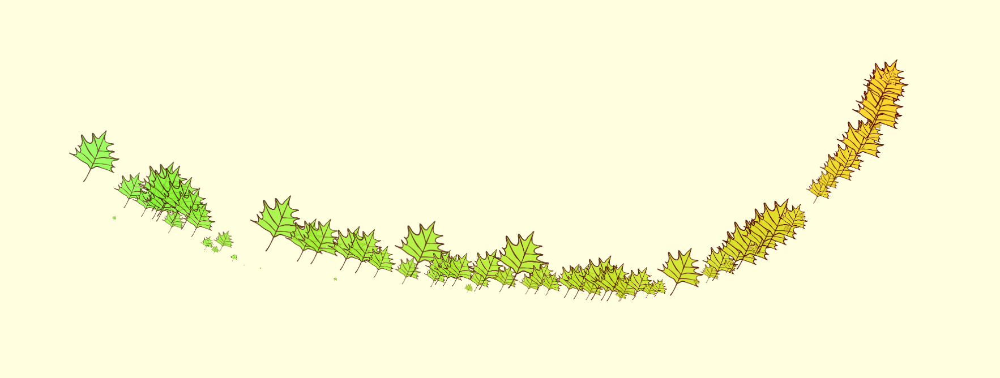

# [Live DEMO](https://rusdiana97.github.io/mouse-trail-animation.github.io/)

# Mouse trail animation 🖱️

## Leaf trail animation 🍁

The leaf is a fall icon.

When you move the mouse on the screen of the device, a trail of leaves will form. The leaves will change their colors, their size and they will disappear after 3000 ms.

